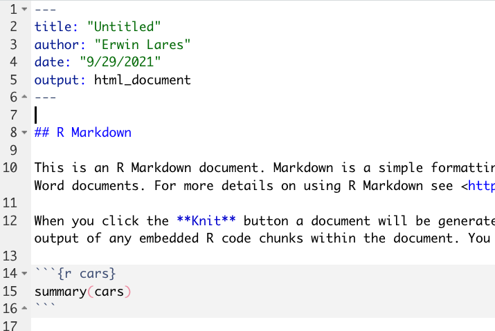

```{r setup, include=FALSE}
knitr::opts_chunk$set(echo = FALSE)


# knitr::opts_chunk$set(echo = FALSE,
#                       message = FALSE,
#                       warning = FALSE)

```

# What is RMarkdown?

RMarkdown is the RStudio implementation of Markdown. Markdown down is a lightweight markup language for creating formatted text using a plain-text editor. An RMarkdown document contains text and code together. You can use RMarkdown to minimally format your text into the prose of your manuscript. The code will become tables, plots, trees and other artifacts that you'll want in your document. 

## Anatomy of an RMarkdown document

There are three distinct parts of your document

1. the YAML header
1. the prose
1. the code
    a. inline code
    a.  fenced code or code _chunks_
    

### YAML header 

It contains meta data for our document. Things like author, title, type of document output, date the document was created, date it was last updated, bib file, and csl file, and a lot more.

If you wanna learn more: https://cran.r-project.org/web/packages/ymlthis/vignettes/yaml-overview.html

### The prose

We'll take a few minutes to explore formatting with RMarkdown. You can do quite a few things natively with RMarkdown. Things like _italics_, **bold face**, superscripts x^2^, subscripts H~2~O, and ~~strike through~~. 

You can also do footnotes, insert pics, and hyperlinks. 

Things you can't do: underline.

Things you technically can, but it is so painful you shouldn't: tables
  
### The code

There are two ways to include code in your document. One is _inline_ code. Inline code will appear within a sentence. It is convenient way to intersperse your data with your prose. For instance, you might be describing you data and say: there are so many observations in the dataset. In the past, you'd have to know the number and type it out. If there were changes to the data, like more people answer your survey, you would have to manually update your code. The better option is to ask R to check the value everytime you need it. That way if there are changes in the data, those changes will be reflected in your prose. 

You add inline code in-between back ticks, like so: `x <- a + b`. This will create verbatim code. Meaning it would look like code but it won't be code. To make it actual code, you need to tell RMarkdown what kind of computer language is that code, so something like `r x <- 1 + 1`. This will evaluate the expression of the right and assign it to a variable on the left, so that now the within the scope of the document, `x` will be equal to `r x`. This is huge for reproducibility!

The code chunk function similarly. They just take three back ticks and they can contain as many lines of code as you want. You still need to tell the language of the code lines (what does that tell you?). The code chunk below loads the libraries we will use throughout the document.

```{r}
library(tidyverse)
library(rmarkdown)
library(knitr)

```

### Code chunk options

See for more https://yihui.org/knitr/options/

```{r}

```

## Read the data in

```{r}

data <- read_csv(url("https://docs.google.com/spreadsheets/d/11Uy21vKsSPDz66tvTMzJnKO8KcksqKcLxX2A1leN-Ds/edit?usp=sharing"))


```

